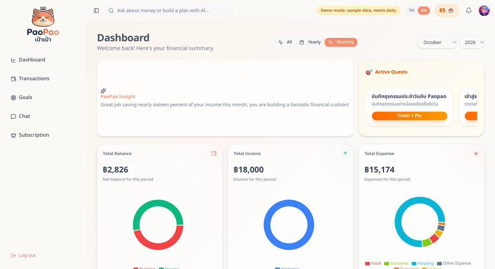
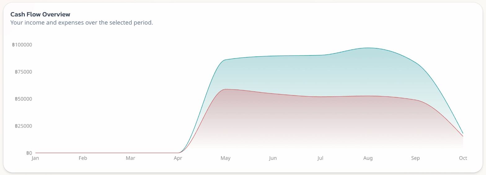
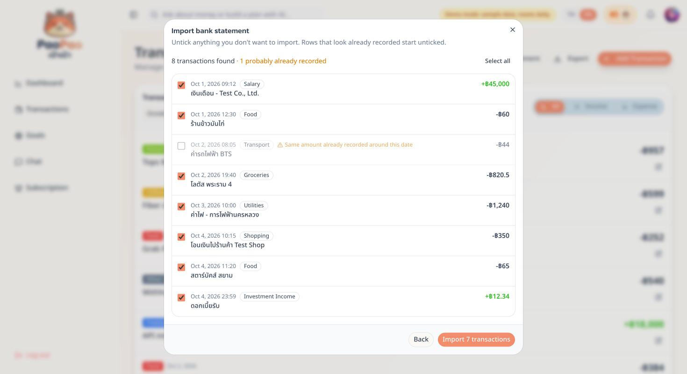
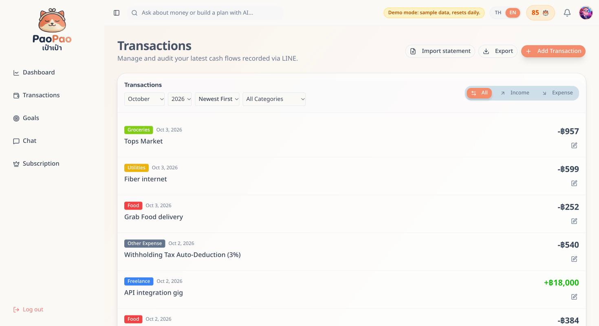
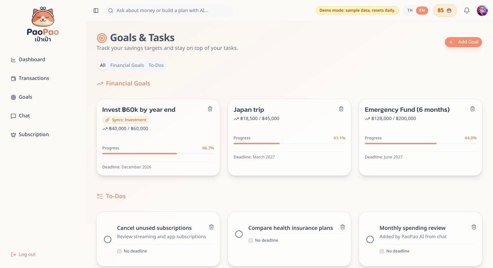
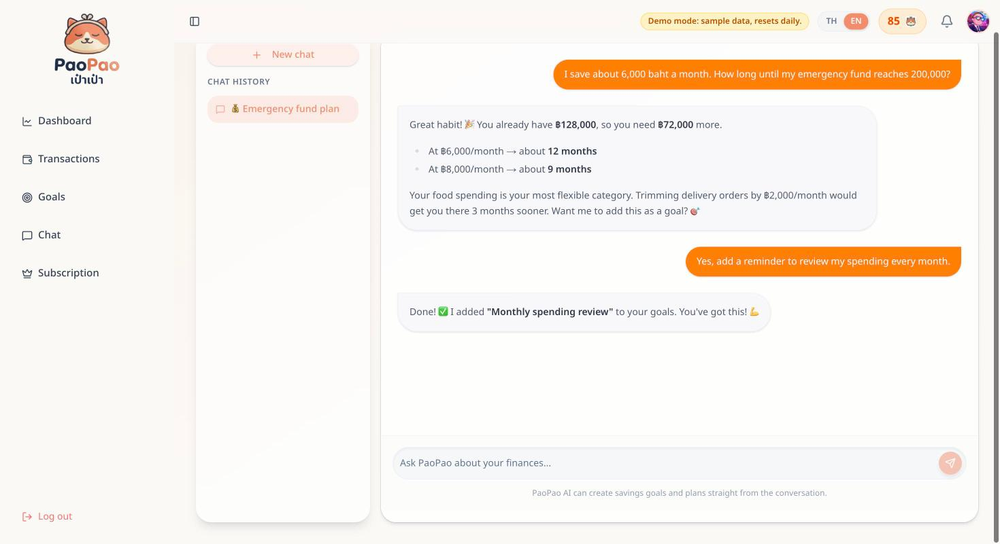
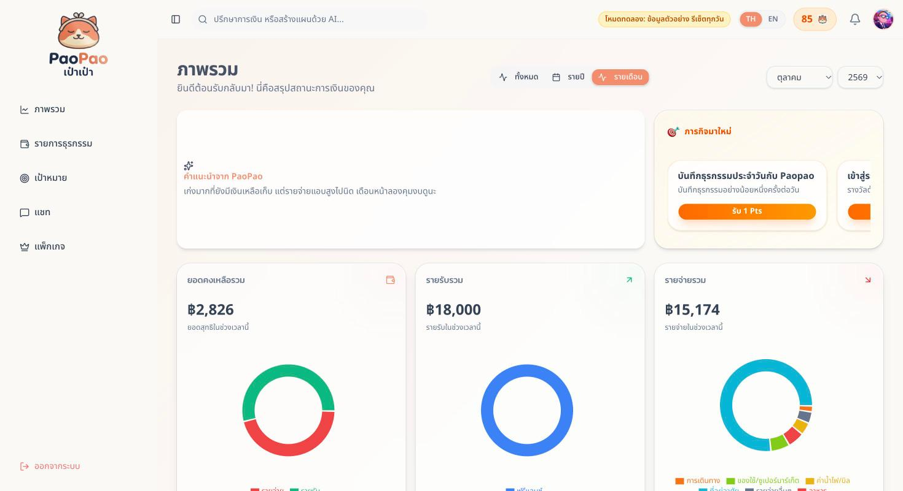
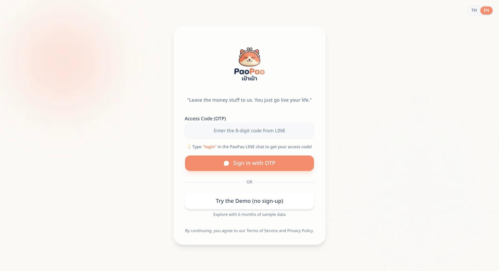

# PaoPao (เป๋าเป๋า) — AI personal finance on LINE

PaoPao lets people track money the way they already talk: send a LINE message like `กาแฟ 65` or a photo of a bank transfer slip, and it is recorded, categorized and summarized. A bilingual (TH/EN) web dashboard shows cash flow, goals and an AI finance chat, and can import whole bank statements.

**Live demo:** https://paopao-wealthness.vercel.app → **Try the Demo** (no sign-up; 6 months of sample data, resets daily).



## Screenshots

| | |
|---|---|
| **Cash flow across months** — income vs. expenses on the yearly view | **Bank statement import** — rows that look already recorded start unticked |
|  |  |
| **Transactions** — everything logged from LINE, editable on the web | **Goals & to-dos** — savings targets can sync progress from a category |
|  |  |
| **AI finance chat** — can create goals for you via tool calling | **Thai interface** — every screen is available in Thai and English |
|  |  |

<details>
<summary>Sign-in page</summary>

Sign in from inside LINE (LIFF, one tap), with an 8-digit code sent by the LINE bot, or try the demo.


</details>

> Screenshots are from the live demo account; all data is generated sample data.

## Features

- **Log by chat or slip photo** via a LINE Official Account. `ข้าวมันไก่ 50 ชาไทย 35` becomes two transactions; a slip photo is read by AI (amount, direction, counterparty, reference number).
- **Duplicate slips are rejected.** Each slip's bank reference and image hash are stored; sending the same slip again (even re-saved as a different file) is refused with the date it was first recorded.
- **Bank statement import** from PDF (including password-protected e-statements), CSV/Excel or a screenshot. Every row is read, Buddhist-era dates are converted, and rows that match transactions already recorded are flagged for review before anything is saved.
- **Automatic categorization** into 24 categories plus the user's own. Social-security and withholding-tax deductions are added automatically for salary and freelance income.
- **Dashboard**: balance, income/expense breakdowns, cash-flow chart, monthly/yearly views, Excel export.
- **Goals & to-dos** that can sync progress from transaction categories; the AI chat can create them.
- **Daily morning brief and goal reminders** pushed to LINE.
- **Freemium**: Pro upgrade by PromptPay QR, verified by reading the payment slip. A payment slip can only ever be used once, by anyone.
- **Thai / English UI** that follows the browser language, with a one-tap toggle.

## How it works

```
LINE app ──► /api/line (webhook, signature-checked)
               │
               ├─ rule-based parser ──────────────┐  simple messages: no AI call
               ├─ Gemini (text / slip image) ─────┤  everything else, with model fallback
               └─ duplicate check (ref + image hash)
                                                  ▼
                                   PostgreSQL (Supabase) via Prisma
                                                  ▲
Web dashboard (Next.js App Router, server actions) ┤
  └─ /api/statements/preview ── Gemini ── match against existing rows
Vercel Cron ──► /api/cron/digest, /api/cron/reminders ──► LINE push
```

| Layer | Choice |
|---|---|
| App | Next.js 16 (App Router, server actions), React 19, Tailwind CSS 4, shadcn/ui |
| Data | PostgreSQL on Supabase, Prisma 7 with the `pg` adapter |
| Messaging | LINE Messaging API + LIFF (one-tap sign-in inside LINE) |
| AI | Google Gemini via `@google/genai` (`src/lib/ai.ts`) |
| Files | `unpdf` for protected PDFs, SheetJS for CSV/Excel |
| Hosting | Vercel (Fluid Compute + Cron) |

### Design decisions

- **AI is the fallback, not the default.** A rule-based parser (`src/services/quick-parse.ts`) handles single-item messages using the user's own history first, then keyword rules. Against 463 real historical notes it covers ~44% of messages without an LLM call. Anything ambiguous (several numbers, refunds, loans) still goes to the AI.
- **Model fallback everywhere.** Every Gemini call walks an ordered model list (`AI_MODELS`), so an overloaded (503), rate-limited (429) or retired (404) model doesn't take the product down. If every model is busy, the list is retried after a short pause. The last model is a lite model that runs on separate capacity, so it usually answers when the larger ones are overloaded.
- **Cost guards.** Daily chat limits per tier (free 10 / pro 100 / shared demo 30) and capped reply length. The morning brief is a template (no LLM) and only goes to users active in the last 7 days, which also saves LINE push quota.
- **Review before import.** Statement rows are matched against existing transactions by bank reference, or by type and amount within a day. Each existing transaction is matched at most once, so genuinely repeated payments stay importable.
- **One source of truth** for categories (`src/lib/categories.ts`), shared by the AI prompt, the UI and the parser, and tested against i18n.

### Security

- **Every query is scoped to the signed-in user.** Server actions start with `getCurrentUser()` (`src/lib/current-user.ts`); updates and deletes always include `userId`.
- **Sessions can't be forged.** The LINE session cookie is HMAC-signed with an expiry (`src/lib/session.ts`). LIFF sign-in sends a LIFF access token that the server verifies with LINE, so the client never chooses its own user id.
- **Sign-in codes resist guessing.** 8-digit codes from a CSPRNG, stored only as an HMAC, with per-IP and system-wide failure limits (`src/lib/otp.ts`).
- **Slips can't be replayed.** Bank references are unique per user for transactions, and globally unique for Pro payments.
- **Fails closed.** Cron routes require `CRON_SECRET`; the admin area requires `ADMIN_PASSWORD`, uses an HMAC cookie and is guarded in a server layout.

## Getting started

Requirements: Node.js 22+, a PostgreSQL database, a LINE Messaging API channel (with a LIFF app), and a Google AI Studio key.

```bash
npm install
cp .env.example .env            # fill in the values
npx prisma migrate deploy       # create the schema
npx tsx prisma/seed-demo.ts     # optional: create the demo account
npm run dev
```

Point the LINE channel's webhook URL to `https://<your-domain>/api/line`. For local development, expose port 3000 with a tunnel such as ngrok.

### Scripts

| Command | What it does |
|---|---|
| `npm run dev` | Start the dev server |
| `npm test` | Unit tests (Vitest) |
| `npm run typecheck` | TypeScript check |
| `npm run lint` | ESLint |
| `npm run build` | Production build (runs `prisma generate`) |

### Environment variables

See [`.env.example`](.env.example). On Vercel, set them for the Production environment and redeploy.

## Project structure

```
src/
  app/            routes: (auth) sign-in/PDPA, (dashboard) pages, admin, api (LINE webhook, statements, cron)
  features/       server actions per domain (transactions, goals, chat, ai, demo, …)
  services/       LINE event handling, AI extraction, rule-based parser, statement import
  lib/            shared building blocks: db, ai client, categories, dates, sessions, OTP, slips
  i18n/           TH/EN messages (type-checked so both languages share the same keys)
  components/     UI components (shadcn/ui based)
prisma/           schema, migrations, demo seed
docs/screenshots/ images used in this README
```

## Testing

```bash
npm test
```

82 unit tests cover the rule-based parser (including regressions found against real data), statement row matching and date normalization, slip reference handling, signed sessions and LIFF verification, OTP generation and rate limits, Bangkok-time dates, the morning brief, and category/i18n consistency. Flows involving LINE, the database and the AI were verified end to end against a real database with throwaway users.
